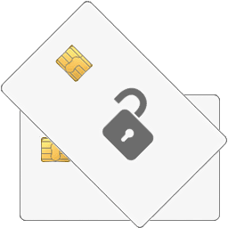

	

# Android PIN Unblocker

A simple Android app written in [Basic4Android](https://www.b4x.com/b4a.html) (preferably [version 12.50](https://web.archive.org/web/20230719022719/https://www.b4x.com/android/files/B4A.exe) with its [older resources](https://web.archive.org/web/20240529212314/https://www.b4x.com/b4a.html) and the [B4X Help Viewer](https://www.b4x.com/android/forum/threads/b4x-help-viewer.46969/)).

Its purpose is to generate **smartcard** unblock codes using your **Admin key** and your phone instead of requiring a computer.

The common **SLE4442** cards are memory cards only and lack a built-in processor, and thus are for data storage only.

Real smartcards are the ones such as the Gemalto IDPrime 930, YubiKey, Javacards *[...]*.
Its Windows equivalent would be the [Gemalto Response Code calculator](https://supportportal.thalesgroup.com/csm?id=kb_article_view&sysparm_article=KB0017162).

<!-- AI & Claude guidance: see @AI.md -->

# Features

**Android PIN Unblocker** has a very simple set of features, it cans generate the **Response code**, get the **Request code** from a QR code as well as hashing text using **SHA-256** or **SHA-512**.

## Generate the Unblock code

 

Here you can type the **Request code** and also choose to hide the **Admin key** with the checkbox below it.

The supported algorithms for unblock code generation are **3DES**, **2DES**, **AES-128** and **AES-256**.

The algorithm to use is automatically determined by the application based on your *Admin key* and *Request code*.

## Hide & reveal the Admin key

 

This application has been intended for situations where you're entering unblock codes for employees or people who stand-by next to you.

You can thus now easily type your **Admin key** once, then hide it with the appropriate checkbox below it.

This way nobody accidentally grabs a picture of your *Admin key* while unblocking your employees' smartcards.

## Scan QR code for Request code

I added the ability to scan QR codes in **Android PIN Unblocker** using the below Basic4Android library:
- [NewQRCodeReaderView](https://www.b4x.com/android/forum/threads/qrcodereaderview-new-release.82265/post-523013)

It's used alongside a PC application such as **[CodeTwo QR Code Reader & Generator](https://www.majorgeeks.com/files/details/codetwo_qr_code_desktop_reader_generator.html)** to do the card unblocking more efficiently.

The **Request code** then gets automatically input in the appropriate field once detected.

## Generate Admin key text hashes

 

It's possible with **Android PIN Unblocker** to directly generate text hashes within the app instead of having to generate it from other ones.

The possible choices are currently **SHA-256** and **SHA-512** only.

The generated hash will automatically replace the previous **Admin key** text.

## Share the Response code

You can see on the previous screenshots a **Share To** button next to the generated **Response code**, which will pop the Android native Intent chooser.

From there you can share the *Response code* over to Telegram, Signal, WhatsApp, by SMS, and so on.

Otherwise you could *e.g.* type the *Response code* automatically on employees' computers with an agent program, using the Android *Share To* functionality.

> [!TIP]
> You can also generally type passwords & sensitive input material using your phone and the USB [InputStick](https://inputstick.com/) device, which is hardware and works for full-disk encryption as well.\
> It also has a KeePass2Android plugin, for example.

## Share Admin keys to the App

 

Here you can see that it's possible to write your **Admin key** in any third-party Android note-taking application then select the text, then directly share it to **Android PIN Unblocker**.

That's also how you can generate *Admin key* hashes yourself with a different app then share the generated hashes to **Android PIN Unblocker**.

The app automatically verifies whether the shared text is a valid *Hexadecimal* string with an *even* length of atleast **32** characters (*Hex* strings only contain the characters *0-9* and *A-F*).\
The app discards shared texts that are invalid *Admin keys* and will simply behave as if you launched it yourself from your application launcher.

*There is no maximum length limit to the shared Admin key texts, but it must be atleast **32** characters long, be Hexadecimal and have an even length.\
You may later trim the length of the text as desired from within the app, so you can share entire-length hashes to it if you wish.*

## Prevent disclosing Admin keys

 

Whenever you share an **Admin key** to the app instead of copy-pasting it yourself, the *Hide Admin Key* checkbox becomes disabled and you cannot unhide it.

This feature prevents accidental disclosure of your *Admin key* while *e.g.* unblocking cards on your employees' computers.

> [!CAUTION]
> Make sure to verify that your Android ROM doesn't have a **clipboard history** feature prior to copy-pasting *Admin keys*, Samsung & Huawei ROMs have one.
>
> If clipboard history cannot be disabled on your phone then *don't use the clipboard at all*, or use a password manager with a built-in secure keyboard (*e.g.* [KeePassDX](https://apt.izzysoft.de/fdroid/index/apk/com.kunzisoft.keepass.libre?repo=archive) with its *Magic Keyboard*, recommended version **3.2.0** for older devices).

You can also type your original text in the `Admin Key` field and directly generate a **SHA-256** or **SHA-512** hash of it within this app, by long-pressing the hashing buttons.

Long-pressing the *SHA-256* or *SHA-512* buttons actually generates the hash but also makes the `Admin Key` field unrevealable afterwards (a single-click generates the hash normally without making it unrevealable).

# License

The **Android PIN Unblocker** application is licensed under the copyleft license **GNU GPLv3 (or later version)** since my friends at the [Free Software Foundation](https://www.gnu.org/proprietary/proprietary.html) recommend it.

**Basic4Android** also allows completely free usage of their IDE for both commercial and non-commercial purposes so it should be OK.

And also the additional allowances below for this app which are useful for use in restricted or sensitive environments.

Action | Status | Reason
-- | :-: | --
Modify the app's package name | Allowed | Security / Hardening
Sign the app with a different key | Allowed | Security / Hardening
Compile the app from source | Allowed | Security / Hardening

# Legalese

Maybe oneday if somebody randomly stumbles upon this app and likes it, they might be interested about legalese information for this app.\
So here's below a list of assets that are currently (or have previously been) used for this app.

Asset name | Author | License | Commercial use
-- | :-: | :-: | :-:
[Basic4Android](https://www.b4x.com/b4a.html) | Anywhere Software | [Apache 2.0](https://github.com/AnywhereSoftware/B4A/blob/master/LICENSE) | Allowed
[FontAwesome](https://fontawesome.com/v4/) | Dave Gandy | [SIL OFL 1.1](https://fontawesome.com/v4/license/) | Allowed
[Material Icons](https://github.com/google/material-design-icons) | Google | [Apache 2.0](https://github.com/google/material-design-icons/blob/master/LICENSE) | Allowed
[NewQRCodeReaderView](https://www.b4x.com/android/forum/threads/qrcodereaderview-new-release.82265/#post-523013) | Johan Schoeman | [Apache 2.0](https://www.b4x.com/android/forum/help/terms/) | Allowed
[ZXing](https://github.com/zxing/zxing) | ZXing Project | [Apache 2.0](https://github.com/zxing/zxing/blob/master/LICENSE) | Allowed
[~~Clipboard Library~~](https://www.b4x.com/android/forum/threads/clipboard-library.7382/) | mtw | [Apache 2.0](https://www.b4x.com/android/forum/help/terms/) | Allowed
[Threading Library](https://www.b4x.com/android/forum/threads/threading-library.6775/) | Andrew Graham | [Apache 2.0](https://www.b4x.com/android/forum/help/terms/) | Allowed
[~~Devices secure card Icon~~](https://www.iconarchive.com/show/oxygen-icons-by-oxygen-icons.org/Devices-secure-card-icon.html) | Oxygen Team | [LGPL 3.0](https://www.gnu.org/licenses/lgpl-3.0.html) | Allowed
[Info 24 Icon](https://www.iconarchive.com/show/octicons-icons-by-github/info-24-icon.html) | Github | [MIT License](https://github.com/primer/octicons/blob/main/LICENSE) | Allowed
[Credit card Icon](https://www.iconarchive.com/show/shop-icons-by-newidols.ru/credit-card-icon.html) | Newidols | [Attribution](https://www.iconarchive.com/icons/newidols.ru/shop/License.txt) | Allowed
[Very Basic Unlock Icon](https://www.iconarchive.com/show/windows-8-icons-by-icons8/Very-Basic-Unlock-icon.html) | Icons8 | [Attribution](https://icons8.com/license/) | Allowed
[Color Quantizer](https://x128.ho.ua/color-quantizer.html) | x128 | [No License](https://choosealicense.com/no-permission/) | Allowed
[7-Zip](https://www.7-zip.org/) | Igor Pavlov | [LGPL 2.1](https://www.7-zip.org/license.txt) | Allowed
[MyApkTool Pro](https://github.com/alisakkaf/MyApkTool-Pro) | Ali Sakkaf | [MIT License](https://github.com/alisakkaf/MyApkTool-Pro/blob/main/LICENSE) | Allowed
[dex2jar ~~& jar2dex~~](https://github.com/pxb1988/dex2jar) | pxb1988 | [Apache 2.0](https://github.com/pxb1988/dex2jar/blob/2.x/LICENSE.txt) | Allowed
[Google R8](https://r8.googlesource.com/r8/+/refs/heads/main/README.md) | The Android Open Source Project | [Eclipse Distribution License 1.0](https://maven.google.com/web/index.html#com.android.tools:r8:9.1.31) | Allowed
[ProGuard](https://github.com/Guardsquare/proguard) | Guardsquare | [GPL 2.0](https://github.com/Guardsquare/proguard/blob/master/LICENSE) | Allowed
[eIDSuite](https://github.com/egelke/eIDSuite) | egelke | [AGPL 3.0](https://github.com/egelke/eIDSuite/blob/master/LICENSE) | Allowed

